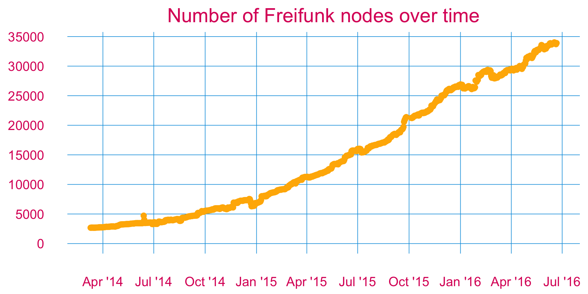
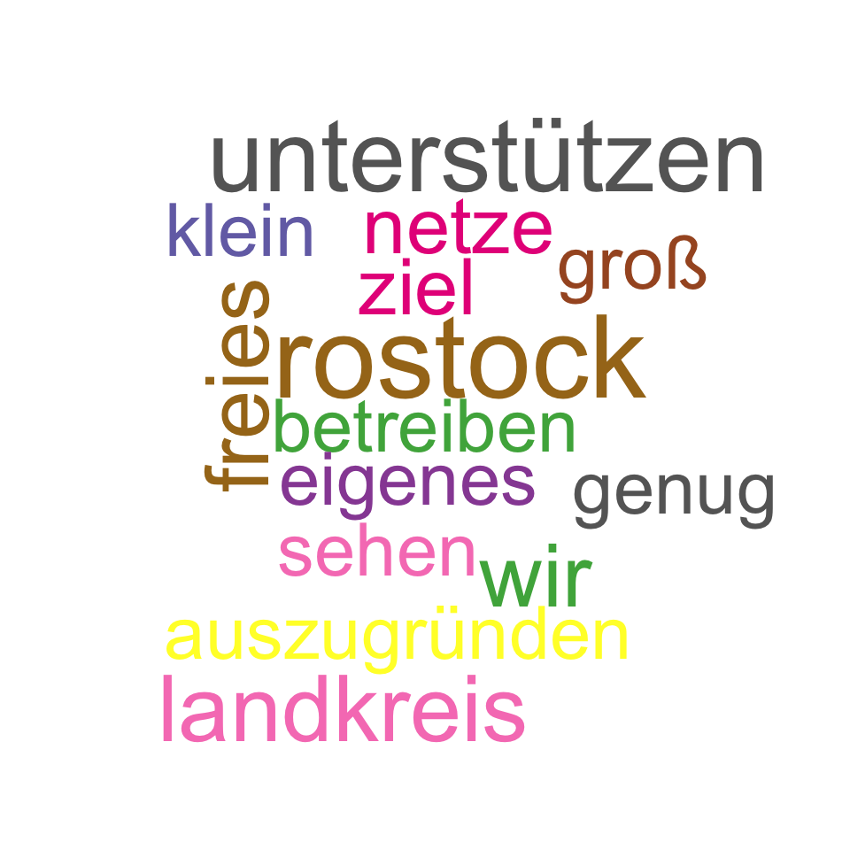
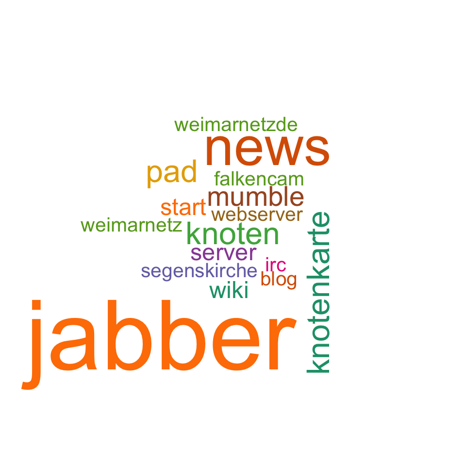
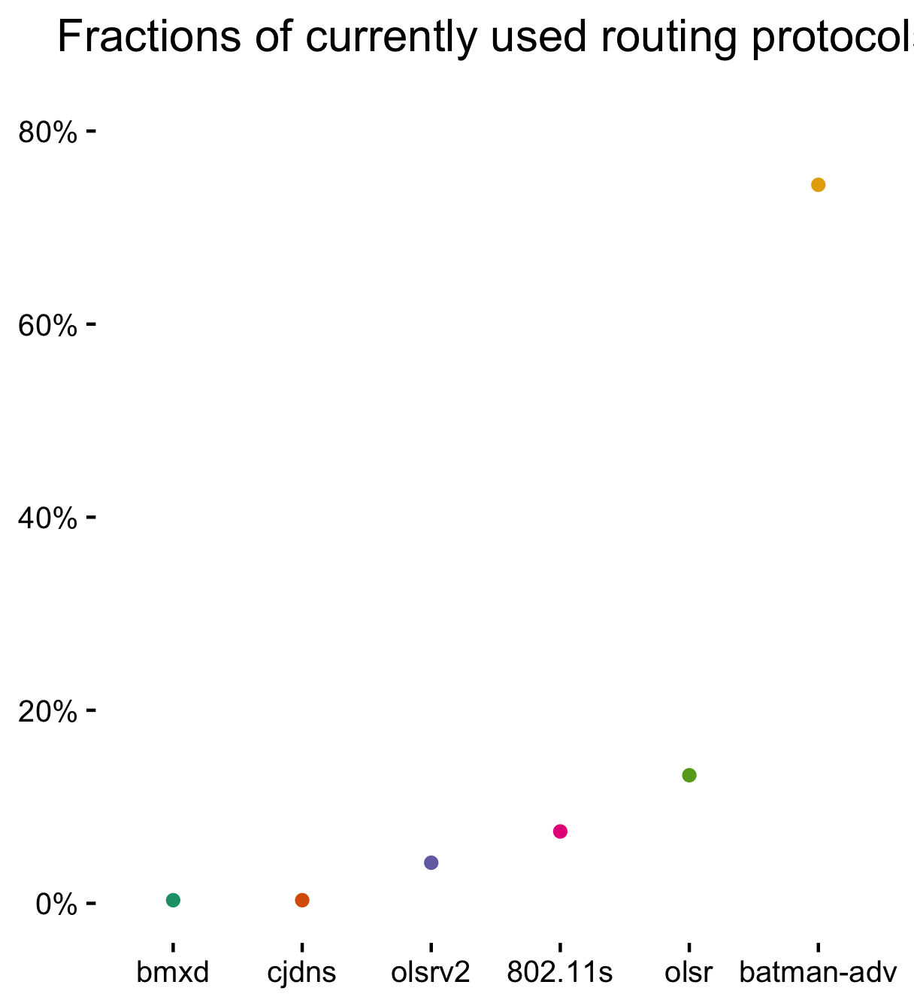
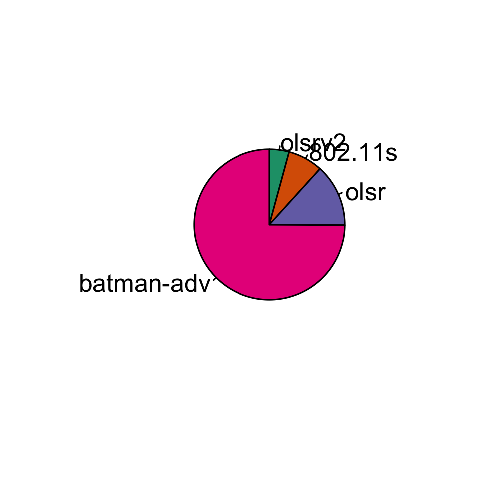

# Visualisation of Freifunk API data

A growing collection of R scripts to extract data from the Freifunk API JSONs and draw interesting diagrams. Inspired by [Andi Bräu's talk at the GPN16](https://media.ccc.de/v/gpn16-7659-die_freifunk_api) and [Freifunk's GSoC ideas](https://wiki.freifunk.net/Ideas#Freifunk_API_visualisation_framework).

Future goals: see [issues](https://github.com/freifunk/vis.api.freifunk.net/issues).

## Time series 

A few dozen data points were omitted, because their JSONs caused parsing problems, like empty CSVs.

## Word cloud of community descriptions

## Word cloud of services run by Freifunk communities

Presented terms appear at lest twice in the [current JSON](https://api.freifunk.net/data/ffSummarizedDir.json).

## Currently used routing protocols

